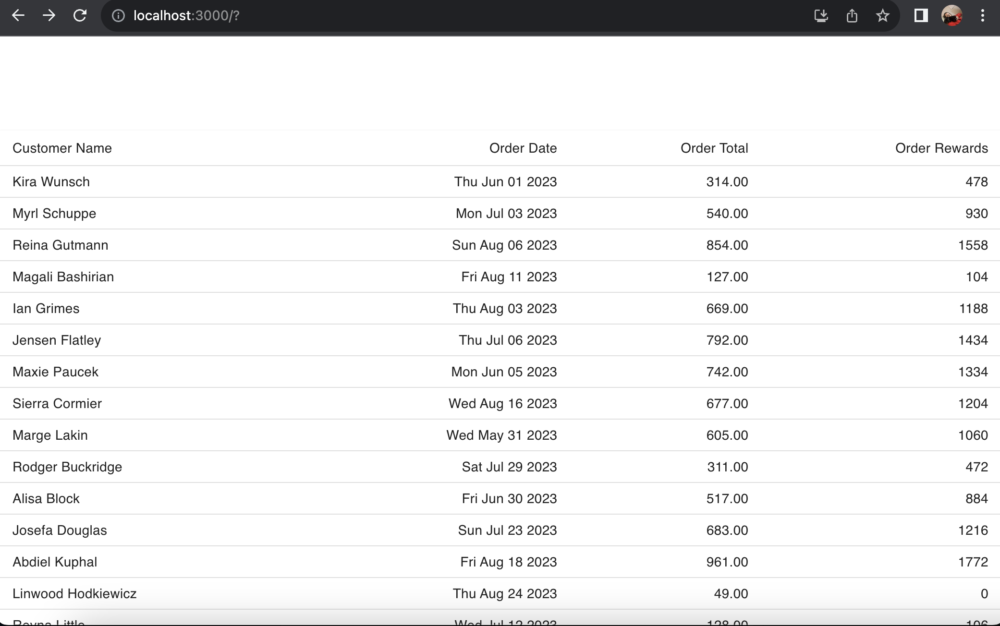

# Assessment Info

Thank you for your time and consideration! This was a fun assessment to complete and show where I am today in my skills and knowledge.

You will find the following project structure: 

### `/assessment` directory housing my front-end code, using React to perform business logic and rendering.
A few notes on my code: 

- Please direct to [`/assessment/src/components/TransactionTable/functions.js`](https://github.com/sidneyrens/charter-assessment/blob/main/assessment/src/components/TransactionTable/functions.js) to see the business logic in managing rewards points.
    - I decided to use mostly constants here, so if there are ever promotions being ran on either tier, or if the business decides to change their reward strategy, we can easily change the thresholds without having to touch the logic.
- Please direct to [`/assessment/src/mocks/transactions.js`](https://github.com/sidneyrens/charter-assessment/blob/main/assessment/src/mocks/transactions.js) to view the generator and data seed I created using [Faker.js](http://www.fakerjs.dev) to mock out the data.
    - This choice did stray from the demonstration of making a basic `asynchronous fetch` defined in the assessment, but I was having fun with reading about faker and figured I would give it a try. I do intend to convert the data to JSON to complete the `fetch` request.

Don't want to pull it down and run it? No offense taken -- here's what it looks like:

 
### `/assessment-api` directory housing my back-end code, using Spring to serve my JSON data.

 

## Available Scripts for React Front End

In the project directory `/assessment`, you can run:

### `npm start`

Runs the app in the development mode. If you view in browser, you will see a fake data seed, displayed with Material UI and showing order totals and calculated order rewards points.\
Open [http://localhost:3000](http://localhost:3000) to view it in your browser.

The page will reload when you make changes.\
You may also see any lint errors in the console.

### `npm test`

Launches the test runner in the interactive watch mode.\
See the section about [running tests](https://facebook.github.io/create-react-app/docs/running-tests) for more information.